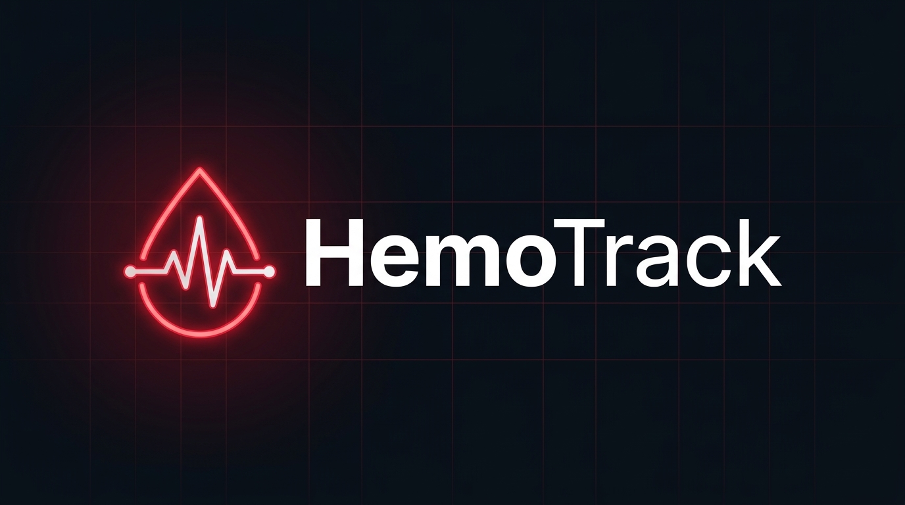
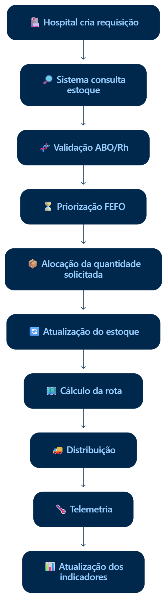
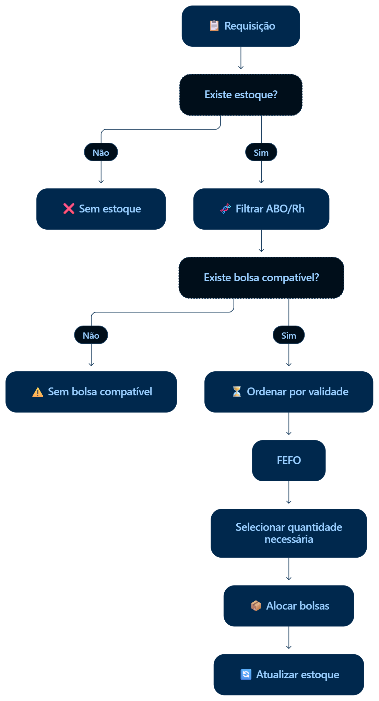
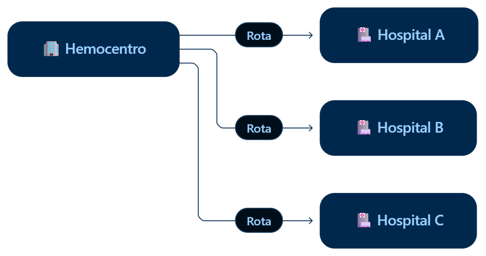
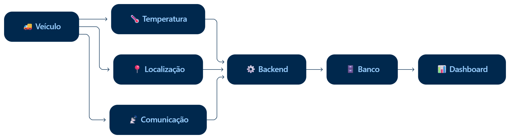
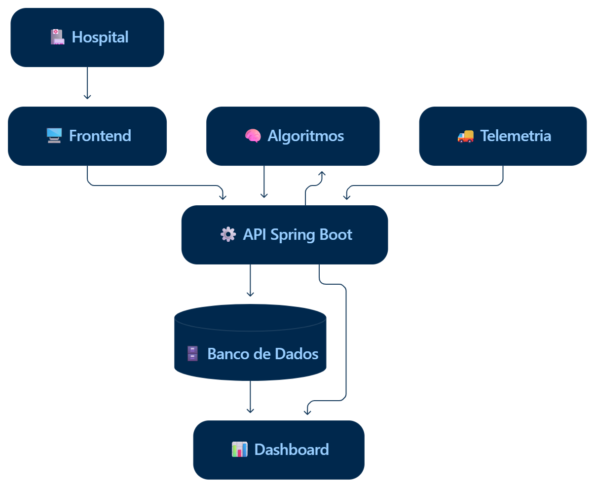
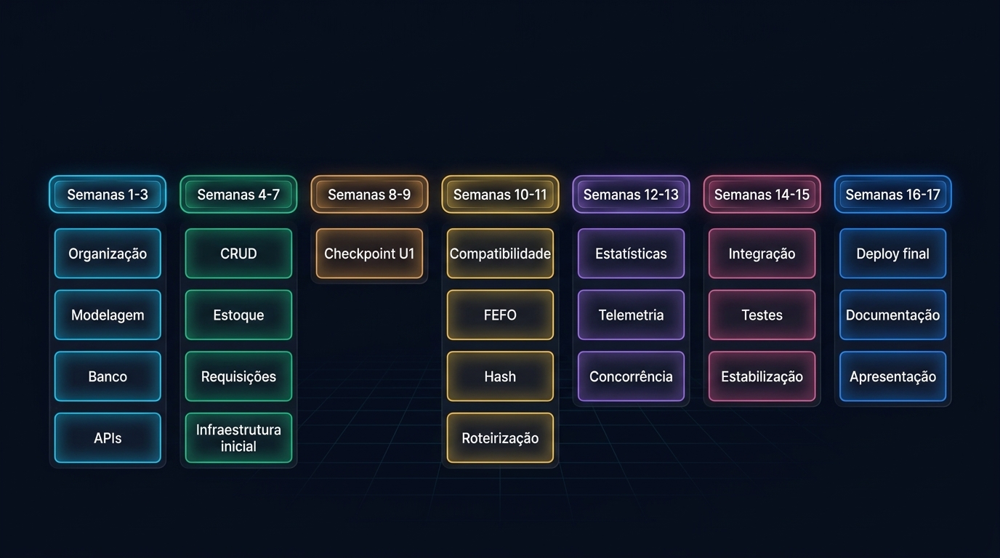

# 🩸 HemoTrack

### Gestão inteligente de hemocomponentes

Sistema web voltado ao gerenciamento de estoque, requisições hospitalares,
compatibilidade sanguínea, distribuição e monitoramento de hemocomponentes.

---

## 📌 Entregas do Projeto

### 🚀 Entrega 01 (31/08)

Esta primeira entrega consolida a especificação dos requisitos do sistema através de histórias de usuário no padrão BDD e a prototipação navegável de baixa fidelidade (Lo-Fi) das jornadas principais.

* *Histórias de Usuário (.MD):* [Acessar Documento de Histórias de Usuário](https://github.com/egs3-coder/HemoTrack/blob/main/docs/user.stories.md)
* *Protótipo Lo-Fi no Figma:* [Visualizar Wireframes no Figma](https://www.figma.com/make/eQxxCgBKHDBxbp5wNhSMW7/Lo-fi-prototype-for-HemoTrack--c%C3%B3pia-?t=GAG7zv0kbjXYIOBL-20&fullscreen=1)
* *Screencast de Apresentação (YouTube):* [Assistir Demonstração no YouTube](https://youtu.be/yJoMx3rl060?si=1mUqssVJ3JXFFymr)

---

### 🚀 Entrega 02 (21/09)

Esta segunda entrega apresenta a implementação do cadastro de bolsas de sangue e da alocação automática por compatibilidade ABO/Rh e regra FEFO.

* *Histórias de Usuário (.MD):* [Acessar Documento de Histórias de Usuário](https://github.com/egs3-coder/HemoTrack/blob/main/docs/entrega_02)
* *Screencast de Apresentação Visual (YouTube):* [Assistir Demonstração no YouTube](https://youtu.be/yJoMx3rl060?si=1mUqssVJ3JXFFymr)
* * *Screencast de Apresentação Código (YouTube):* [Assistir Demonstração no YouTube](https://youtu.be/yJoMx3rl060?si=1mUqssVJ3JXFFymr)

---

## 📌 Sobre o projeto

O **HemoTrack** é uma aplicação desenvolvida para apoiar o controle e a
distribuição de hemocomponentes entre hemocentros e hospitais.

O sistema busca integrar, em um único fluxo:

- 🏥 requisições hospitalares;
- 🩸 controle de estoque;
- 🧬 compatibilidade ABO/Rh;
- ⏳ priorização FEFO;
- 🗺️ roteirização;
- 🌡️ telemetria;
- 📊 indicadores e dashboard.

---

## 👥 Equipe

> As fotos estão associadas **de forma aleatória por enquanto**, conforme solicitado.  
> Depois vocês podem realocar cada imagem para o integrante correto sem alterar a estrutura.

<table align="center">
  <tr>
    <td align="center" width="220">
       
      <b>Ewerton Guilherme da Silva</b> 
      Product Owner
    </td>
    <td align="center" width="220">
       
      <b>Pablo Arthur Eustáquio de Lima</b> 
      Backend Developer
    </td>
    <td align="center" width="220">
       
      <b>João Ricardo Alves de Brito</b> 
      Backend Developer
    </td>
    <td align="center" width="220">
       
      <b>Lucas Aprigio dos Santos</b> 
      Backend Developer
    </td>
  </tr>
  <tr>
    <td align="center">
       
      <b>Saulo Eduardo Almeida dos Santos</b> 
      Backend Developer
    </td>
    <td align="center">
       
      <b>Thiago Cardozo da Conceição</b> 
      Frontend / UI Designer
    </td>
    <td align="center">
       
      <b>Eloi de Lima Sousa</b> 
      Frontend / UI Designer
    </td>
  </tr>
</table>

---

## 🎯 Objetivo

Desenvolver uma solução capaz de atender requisições hospitalares de forma
organizada, garantindo:

- disponibilidade de bolsas;
- seleção por compatibilidade sanguínea;
- priorização pela validade;
- alocação correta da quantidade;
- cálculo de rotas de distribuição;
- atualização de indicadores;
- monitoramento da telemetria.

---

## ⚙️ Funcionalidades principais

### 🏥 Gestão hospitalar
- cadastro de hospitais;
- consulta e atualização;
- controle de requisições.

### 🩸 Controle de estoque
- cadastro de bolsas;
- tipo sanguíneo e fator Rh;
- hemocomponente;
- validade;
- quantidade disponível;
- disponibilidade em estoque.

### 📋 Requisições
- hospital solicitante;
- hemocomponente;
- tipo sanguíneo;
- quantidade;
- nível de urgência;
- status da solicitação.

### 🧬 Inteligência do sistema
- compatibilidade ABO/Rh;
- priorização FEFO;
- alocação da quantidade correta;
- roteirização;
- atualização automática do estoque.

---

## 📊 Fluxo principal do sistema

  

---

## 🧠 Compatibilidade + FEFO

  

### Regra de alocação

Se houver:

- **2 bolsas disponíveis em estoque**
- e o hospital solicitar **1 bolsa**

o sistema deverá:

- alocar somente **1 bolsa**
- manter **1 bolsa restante no estoque**

---

## 🗺️ Distribuição

  

O **HemoTrack** também considera a etapa de distribuição, permitindo
organizar o envio de hemocomponentes do hemocentro para os hospitais.

---

## 🌡️ Telemetria

  

A telemetria permite acompanhar informações como:

- temperatura;
- localização;
- comunicação do transporte;
- envio dos dados para backend;
- persistência em banco;
- exibição em dashboard.

---

## 🏗️ Arquitetura geral

  

---

## 🚀 Etapas do desenvolvimento

### 1. Base do sistema
- modelagem;
- banco de dados;
- APIs;
- CRUD;
- estoque;
- requisições.

### 2. Inteligência
- compatibilidade ABO/Rh;
- FEFO;
- hash;
- roteirização.

### 3. Monitoramento
- estatísticas;
- telemetria;
- concorrência;
- dashboard.

### 4. Finalização
- integração;
- testes;
- estabilização;
- documentação;
- apresentação.

---

## 📅 Roadmap

  

---

## ✅ Critério de conclusão

O **HemoTrack** será considerado funcional quando for possível demonstrar:

1. o hospital cria a requisição;
2. o sistema consulta o estoque;
3. ocorre a validação ABO/Rh;
4. o sistema aplica FEFO;
5. a quantidade correta é alocada;
6. o estoque é atualizado;
7. a rota é calculada;
8. a distribuição é registrada;
9. a telemetria é acompanhada;
10. os indicadores são atualizados no dashboard.

---

## 🛠️ Tecnologias previstas

- **Frontend**
- **Backend com Spring Boot**
- **Banco de Dados**
- **Algoritmos e estruturas de dados**
- **Dashboard**
- **Telemetria**
- **CI/CD**

---

## 🩸 HemoTrack

**Do estoque à entrega, informação para salvar tempo.**

